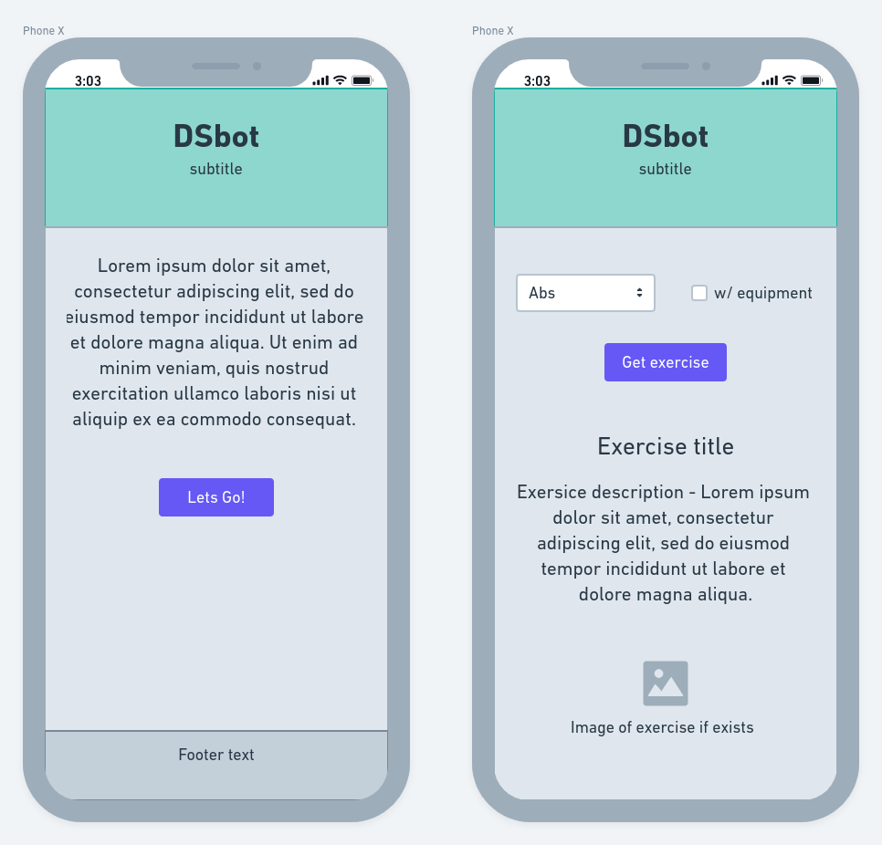
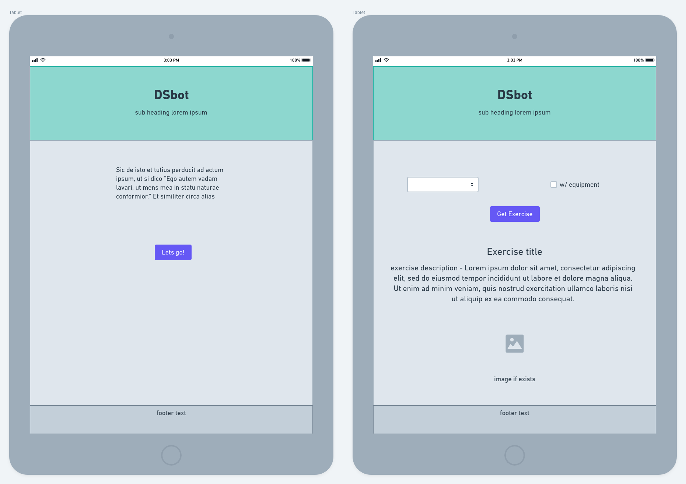

# DSbot

## Description

DSbot or Drill Sergeant bot is a random exercise generator built with html, css, and vanilla javascript. This web application is designed for users who are going to workout but are unsure of an exercise to perform or want to try something new. The user can generate a random exercise by either selecting a muscle group or a specific muscle they want to target, and whether or not they will have access to equipment during the workout. After hitting the button to generate an exercise, the title of the exercise and a short descriptiion will render on screen. Some exercises on the database have an image url included, and they will also render underneath the description. The user could also select an intensity level to receive a recommended number of sets and reps.

## Wireframes

## API

All the data will come from the [wger Workout Manager REST API](https://wger.de/en/software/api). There is no API key required for access to the endpoints used for this app.

## MVP

At the minimum, this app will be built responsively with a mobile first approach due to the likliness that most users will use a smart phone before or during a workout to interact with the app. After selecting the desired muscle or muscle group, the user will receive an appropriate exercise. They will be able to continue to generate a random exercise.

## Post MVP

The user will be able to create a list of exercises that will be saved to localstorage. They will have the ability to add or remove a random exercise or clear the entire list.
